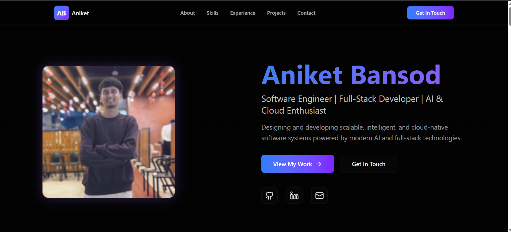

# Personal Portfolio – React + TailwindCSS

Showcasing my frontend engineering work, projects, and experience with a fast, modern, and responsive portfolio.

## 🔗 Live Demo

https://portfolio-cdpn.vercel.app

## 📸 Preview


## 🚀 Features

- Responsive hero with gradient branding and CTAs
- About, Skills, Experience, Projects, Achievements, Education, and Contact sections
- Smooth, subtle animations (CSS-based) and hover interactions
- Modern dark UI with system preference + persisted theme
- Reusable, composable React components
- Fully responsive layout with TailwindCSS v4 utilities
- SEO-friendly meta tags and theme-color in `index.html`
- Vercel-ready build output for fast, global hosting

## 🛠️ Tech Stack

- React.js (Vite + `@vitejs/plugin-react`)
- Vite (fast dev, optimized build)
- TailwindCSS v4 (`@tailwindcss/postcss` + design tokens)
- Lucide Icons (`lucide-react`)

## 📦 Installation

```bash
# Clone the repo
git clone <your-repo-url>
cd <repo-folder>

# Install dependencies
npm install

# Start development server
npm run dev

# Build for production
npm run build
```

## 📂 Folder Structure

- `/src/components` – UI building blocks (Navigation, Hero, About, Skills, Experience, Projects, Achievements, Education, Contact, Footer)
- `/src/App.jsx` – Section composition and page layout
- `/src/main.jsx` – App entry + React mount
- `/src/index.css` – Tailwind import + color tokens (light/dark)
- `/public` – Static assets used at runtime
- `/docs` – Project docs and preview image(s)
- `/vite.config.js` – Vite + React plugin, alias `@ -> /src`
- `/postcss.config.js` – Tailwind v4 PostCSS setup
- `/index.html` – HTML shell, meta tags, theme bootstrap

## ⚙️ Customization

- Colors: Edit design tokens in `src/index.css` (`:root` and `.dark`). Tailwind maps these via the `@theme inline` block.
- Branding: Update titles/meta in `index.html`, favicon, gradients, and copy in `Hero.jsx` and `Navigation.jsx`.
- Profile details: Update content in `About.jsx`, `Skills.jsx`, `Experience.jsx`, `Achievements.jsx`, `Education.jsx`, and `Contact.jsx`.
- Project data: Add/edit items in `Projects.jsx` and update links/icons.
- Social links: Tweak links in `Hero.jsx` and `Footer.jsx` (icons via `lucide-react`).

## 📤 Deployment (Vercel)

This project includes `vite.config.js`, so Vercel will auto-detect the framework.

- New Project → Import Git repo
- Framework preset: Vite
- Build command: `npm run build`
- Output directory: `dist`
- Optional: set `NODE_VERSION` in Vercel if you need a specific runtime

## 🙌 Credits

- React, Vite, TailwindCSS
- Icons by `lucide-react`
- Inspiration from modern developer portfolios and Tailwind design patterns
